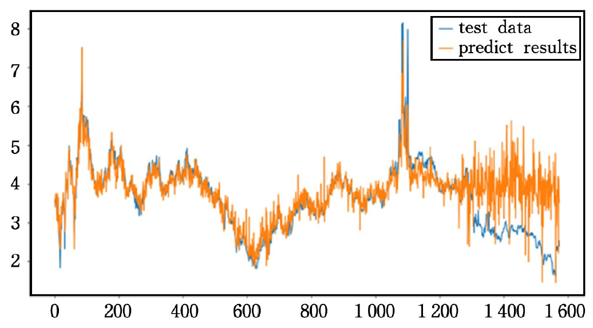

# Tianxiang Li

### Ph.D Candidate 

Center of Digital Dentistry, Faculty of Prosthodontics  
Peking University school and hospital of Stomatology  
Beijing, China

# Biography

I am a doctoral student studying at the Center of Digital Dentistry, [Peking University School and Hospital of Stomatology](https://ss.bjmu.edu.cn/). I am working with teachers Sun Yuchun and Tian Sukun. Before that, I received my master's degree from the University of Chinese Academy of Sciences. Graduated from the Computer Science Department of Jilin University with a bachelor's degree.  
  
My research interests include *3D completion and reconstruction* and *metamaterial design*. Specifically, I focus on using 3D computer technology to solve design and segmentation tasks in dentistry. In addition, I am also working on metamaterial structure design and gingival margin line fenge tasks.

# News

+   \[05/2024\] Our paper on video shadow detection is accepted at [CVPR'2023](https://cvpr2023.thecvf.com/)!
+   news1
+   news2
+   news3

# Publications
<table id="tbPublications">
<tbody><tr><td>

</td><td><b>News-based Research on Forecast of International Natural gas price trend</b> 
<b>Li Tianxiang</b>, Han Xiaosong, Wang Aoqing, Li Hui, Liu Guosheng, Pei Ying <em>FSDM[C], 2020.</em>

[<a href="https://books.google.com/books?hl=zh-CN&lr=&id=ey4NEAAAQBAJ&oi=fnd&pg=PA194&dq=News-based+Research+on+Forecast+of+International+Natural+gas+price+trend&ots=2maa8AyIH5&sig=_iY4BmQzlqeo-dc7hvejDs3IPGM#v=onepage&q=News-based%20Research%20on%20Forecast%20of%20International%20Natural%20gas%20price%20trend&f=false" target="_blank">paper</a>]

</td></tr><tr></tr><tr></tr><tr></tr><tr><td></td>
</table>

FSDM 2020

[News-based Research on Forecast of International Natural gas price trend](https://books.google.com/books?hl=zh-CN&lr=&id=ey4NEAAAQBAJ&oi=fnd&pg=PA194&dq=News-based+Research+on+Forecast+of+International+Natural+gas+price+trend&ots=2maa8AyIH5&sig=_iY4BmQzlqeo-dc7hvejDs3IPGM#v=onepage&q=News-based%20Research%20on%20Forecast%20of%20International%20Natural%20gas%20price%20trend&f=false)

**Li Tianxiang**, Han Xiaosong, Wang Aoqing, Li Hui, Liu Guosheng, Pei Ying

[**Github Link**](https://github.com/Hugo271828/gasNewsPickle) <strong></strong>
- Use gas price and news text to predit gas price trend.

Experience
------
- University of Chinese Academy of Sciences, Sep. 2020-Jun.2023  
- Master of Computer Application Technology, Urumqi  
- Jilin University, Sep.2016-Jun.2020  
- Bachelor of Computer Science and Technology, Changchun  
- Bachelor of Accounting, Double degree, Changchun  

Honors & Awards
------
1. Individual Scholarship, Jilin University	2017, 2018  
2. Second prize, National English Competition for College Students 2017, 2018  
3. First prize, Mathematical Modeling Competition in Jilin province	2018  
4. Third prize, Asia-Pacific Mathematical Modeling Competition		2018  
5. Merit student of Chinese Academy of Sciences University		2022  

Professional Activities
------
1. s
2. s
3. s
4. s
5. s
6. s

